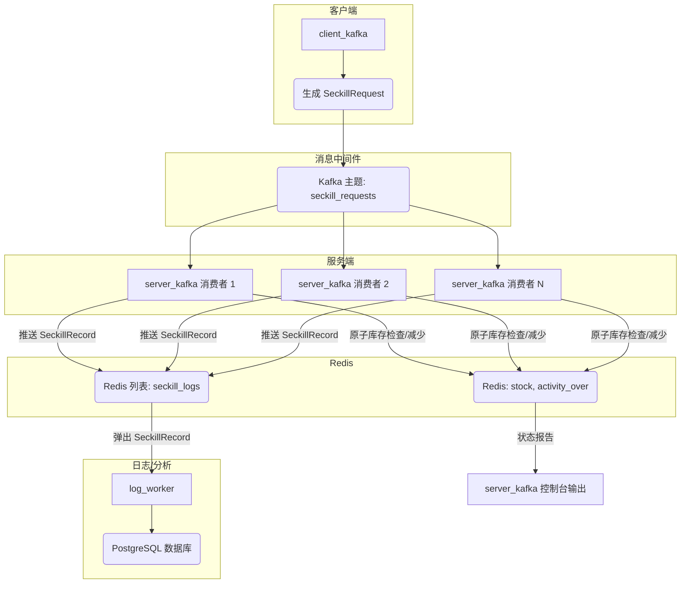

# 基于 Kafka 的秒杀系统架构文档

## 1. 项目概述

本项目模拟了一个高并发的秒杀系统，旨在处理大量并发用户请求。系统基于 Apache Kafka 的消息队列和 Redis 的原子操作，支持多商品秒杀、实时库存同步以及日志持久化。通过 HTTP 控制接口可以在运行时调整库存或结束活动。

## 2. 核心组件

系统由几个独立的 Rust 二进制文件组成，每个文件都扮演着特定的角色：

### 2.1. `client_kafka` (Kafka 生产者)

*   **角色**: 通过生成并发送消息到 Kafka 主题来模拟用户的秒杀请求。
*   **功能**:
    *   从 `config.yaml` 和命令行参数中读取配置（Kafka Brokers、主题、用户数量、请求速率、延迟）。
    *   初始化 `rdkafka::producer::FutureProducer`。
    *   为指定数量的唯一用户生成 `SeckillRequest` 消息。
    *   打乱用户 ID 以模拟不同的请求模式。
    *   将 `SeckillRequest` 消息作为 JSON 有效载荷发送到配置的 Kafka 主题。
    *   包含基本的速率限制和消息延迟，以控制请求注入速率。
*   **关键数据结构**: `SeckillRequest`。

### 2.2. `server_kafka` (Kafka 消费者 & 秒杀逻辑处理器)

*   **角色**: 从 Kafka 消费秒杀请求，根据 Redis 中的可用库存进行处理，并记录结果。
*   **功能**:
    *   读取配置（Kafka Brokers、主题、初始库存、超时时间、消费者数量、状态报告间隔、Redis URL、Kafka 消费者组 ID）。
    *   初始化 `deadpool-redis` 连接池，并在 Redis 中设置初始库存和活动状态 (`activity_over`)。
    *   创建 `rdkafka::consumer::StreamConsumer` 并订阅 Kafka 主题。
    *   支持将 Kafka 偏移量重置到最新可用消息（`auto.offset.reset=earliest` 或显式 `Offset::End` 分配）。
    *   启动多个异步消费者任务（`args_consumers`），每个任务使用 `for_each_concurrent` 并发处理消息。
    *   **秒杀逻辑**:
        *   对于每个传入的 `SeckillRequest`:
            *   计算请求的 `cost_ms`（从请求发起开始经过的时间）。
            *   根据 `timeout_ms` 检查请求是否超时。
            *   检查 Redis 中秒杀活动是否已被标记为结束。
            *   执行 Redis Lua 脚本 (`run_seckill_script`) 以原子性地完成以下操作：
                1.  检查活动是否结束。
                2.  检查库存是否可用。
                3.  如果库存可用，原子性地减少库存并增加成功计数器。
                4.  如果库存变为零，将活动标记为结束。
            *   如果秒杀成功，则创建 `SeckillRecord` 并将其推送到名为 `seckill:logs` 的 Redis 列表中。
    *   维护原子计数器 (`AtomicUsize`)，用于统计总请求数、成功请求数、超时数和失败数。
    *   定期向控制台提供状态报告（剩余库存、活动状态、成功/超时/失败计数）。
*   **关键数据结构**: `SeckillRequest`, `SeckillRecord`。
*   **依赖**: `rdkafka`, `deadpool-redis`, `redis`, `tokio`, `clap`, `serde_yaml`。

### 2.3. `log_worker` (日志消费与数据库持久化器)

*   **角色**: 异步消费 `seckill:logs` Redis 列表中的成功秒杀记录，并批量写入 PostgreSQL 数据库。
*   **功能**:
    *   连接到 Redis 和 PostgreSQL。
    *   使用 `BRPOP` 阻塞弹出日志条目，批量缓存并定时写入数据库。
    *   定期打印状态报告，便于监控 Worker 运行状况。
*   **依赖**: `redis`, `sqlx`, `tokio`。

### 2.4. `control_api` (库存与活动控制接口)

*   **角色**: 提供基于 HTTP 的管理接口，用于在运行时调整库存、结束活动以及同步数据库库存到 Redis。
*   **功能**:
    *   `/set_stock` 重置指定商品库存并广播通知。
    *   `/finish_activity` 标记活动结束。
    *   `/status` 查询当前库存、统计数据与版本号。
    *   `/sync_from_db` 从数据库同步库存到 Redis。
*   **依赖**: `axum`, `redis`, `sqlx`。

## 3. 共享模块

### 3.1. `src/common.rs`

*   定义了跨不同组件使用的通用数据结构：
    *   `SeckillRequest`: 表示用户请求，包含 `user_id`、`items`（商品与数量的映射）和 `request_initiation_time`。
    *   `SeckillResult`: 主要用于旧版模拟，不再在核心流程中使用。
    *   `SeckillRecord`: 记录成功的秒杀事件，字段包括 `user_id`、`activity_id`、`item_id`、`quantity`、`cost_ms`、`status` 和 `timestamp`，会被推送到 Redis 日志队列。

### 3.2. `src/redis_state.rs`

*   封装了所有与 Redis 相关的操作，提供了与 Redis 存储交互的清晰 API：
    *   `get_stock`: 查询指定 `item_id` 的库存。
    *   `is_activity_over`: 检查秒杀活动是否已被标记为结束。
    *   `set_activity_finish`: 将秒杀活动标记为结束并广播通知。
    *   `init_state`、`set_stock`、`sync_redis_from_db`: 用于初始化和重置多商品库存。
    *   `run_seckill_script`: 执行核心 Lua 脚本，原子性地校验并扣减多个商品的库存。
    *   `pop_log_detail`: 从 `seckill:logs` 列表弹出日志条目供 `log_worker` 消费。
    *   `get_stats`、`get_version`、`incr_version`: 查询或递增统计和版本号。

## 4. 数据流和交互

1.  **请求生成**: `client_kafka` 二进制文件生成 `SeckillRequest` 消息，将其序列化为 JSON，并发送到指定的 Kafka 主题。
2.  **请求排队**: Kafka 作为可靠、高吞吐量的消息队列，缓冲请求直到 `server_kafka` 消费者准备好处理它们。
3.  **请求处理**: 多个 `server_kafka` 实例/线程从 Kafka 主题消费消息。每个消费者并发处理请求。
4.  **原子库存管理**: 对于每个请求，`server_kafka` 执行一个 Redis Lua 脚本 (`run_seckill_script`)。该脚本确保库存检查、减少和活动状态更新作为单个不可分割的事务原子性地执行，从而防止超卖并确保高并发环境中的数据一致性。
5.  **成功日志记录**: 如果秒杀请求成功（库存可用并已减少），`server_kafka` 会创建一个 `SeckillRecord` 并将其推送到 Redis 列表 (`seckill:logs`)。这作为成功交易的临时缓冲区。
6.  **持久化日志记录**: `log_worker` 从 `seckill:logs` Redis 列表消费 `SeckillRecord`，批量写入 PostgreSQL 数据库，用于长期存储、分析和审计。
7.  **实时监控**: `server_kafka` 提供定期的控制台输出，总结秒杀的当前状态（剩余库存、成功/失败/超时计数），提供即时操作洞察。

## 5. 关键技术

*   **Rust**: 主要的编程语言，因其性能、内存安全和并发特性而被选中。
*   **Apache Kafka**: 作为中央消息总线的分布式流处理平台。它为秒杀请求提供高吞吐量、容错的队列，解耦了客户端和服务端组件。
*   **Redis**: 内存数据结构存储，用于：
    *   **原子库存管理**: 使用 Lua 脚本确保库存安全、一致地在多个并发消费者之间减少，这一点至关重要。
    *   **活动状态**: 存储一个标志，指示秒杀活动是否已正式结束。
    *   **临时日志记录**: 作为成功秒杀记录在持久化到数据库之前的缓冲区。
*   **`deadpool-redis`**: Redis 的连接池，有效管理连接并防止资源耗尽。
*   **`rdkafka`**: 健壮的 Rust Apache Kafka 客户端库，支持消息的异步生产和消费。
*   **`tokio`**: Rust 的异步运行时，为并发操作、非阻塞 I/O 和高效任务管理提供基础。
*   **`sqlx`**: (由 `Cargo.toml` 和 `config.yaml` 暗示) Rust 的异步 SQL 工具包，可能由 `log_worker` 用于与 PostgreSQL 交互。
*   **`clap`**: 强大的命令行参数解析器，用于灵活配置二进制文件。
*   **`serde` / `serde_json` / `serde_yaml`**: 用于 Rust 数据结构与 JSON（用于 Kafka 消息）和 YAML（用于配置文件）之间序列化和反序列化的库。

## 6. 并发与原子性

*   **异步编程 (`tokio`)**: 系统大量依赖 `tokio` 进行异步操作，允许多个 I/O 密集型任务（如 Kafka 消息处理或 Redis 交互）并发运行而不会阻塞主线程。
*   **共享状态 (`Arc`, `AtomicUsize`)**: `Arc` (原子引用计数) 用于在多个异步任务之间共享不可变数据或受内部可变性（如 `Mutex` 或 `AtomicUsize`）保护的数据。`AtomicUsize` 提供线程安全的、非阻塞的计数器，用于跟踪指标（请求、成功、超时、失败）。
*   **Redis Lua 脚本**: `src/redis_state.rs` 中的 `run_seckill_script` 函数对于确保原子性至关重要。通过直接在 Redis 服务器上执行 Lua 脚本，整个库存检查、减少和活动状态更新操作作为单个、不可分割的事务执行。这消除了可能导致超卖的竞态条件，如果这些操作是在应用程序层作为单独命令执行的话。

## 7. 配置管理

*   **`config.yaml`**: 一个中央 YAML 配置文件 (`config.yaml`) 定义了 `server_kafka` 和 `client_kafka` 的默认设置，包括 Kafka brokers、主题名称、初始库存、用户数量和 Redis 连接详细信息。
*   **命令行覆盖**: 所有配置参数都可以通过命令行参数进行覆盖，为不同的部署环境或测试场景提供灵活性。命令行参数优先于 `config.yaml` 中的值。

## 8. 未来考虑和增强

*   **健壮的错误处理和日志记录**: 实施更全面的日志框架（例如，`tracing` 或 `log` crate），以便在生产环境中更好地进行可观察性和调试。
*   **监控和警报**: 与 Prometheus 和 Grafana 等监控工具集成，以收集和可视化实时指标（例如，请求吞吐量、成功率、延迟、库存水平），并为关键事件设置警报。
*   **幂等性**: 实施机制以确保处理 Kafka 消息是幂等的，防止在消费者重试或失败时重复处理请求。
*   **高级速率限制**: 在服务器端引入更复杂的速率限制策略，以保护后端服务免受过载。
*   **数据库 Schema 和 ORM**: 为 `SeckillRecord` 定义清晰的数据库 Schema，并可能在 `log_worker` 中使用 `sqlx` 的查询宏进行类型安全的数据库交互。
*   **分布式追踪**: 与分布式追踪系统（例如，OpenTelemetry）集成，以获得跨组件请求流的端到端可见性。
*   **优雅停机**: 增强停机过程，确保所有正在处理的消息都被处理，并且资源被正确释放。
*   **消费者组再平衡**: 监控和优化 Kafka 消费者组再平衡行为，以实现高可用性和高效的分区分配。
*   **安全性**: 为 Kafka 和 Redis 连接实现身份验证和授权。
*   **测试**: 扩展单元测试和集成测试，以覆盖更多场景和边缘情况。
